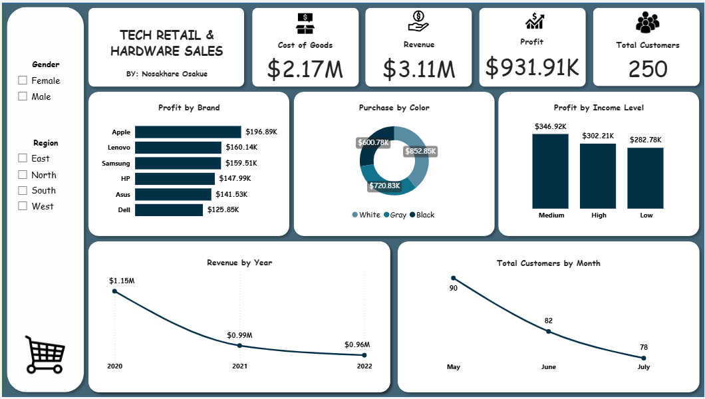

# tech-retail-sales-analytics
A Power BI case study analyzing $3.11M in retail sales performance, gross profit margins, and customer demographic trends.

## Tech Retail Sales Performance Analysis
**Executive Sales & Revenue Performance Report**

---

## 1. Executive Summary
This case study evaluates the sales performance of a global hardware and tech retail business using Power BI. The analysis evaluates **$3.11M** in Total Revenue across **5,200 transactions** and **250 distinct customers**. The objective was to transform multi-table relational sales data into an interactive executive dashboard to uncover profitability drivers across product brands, customer income segments, product attributes, and geographic regions.

---

## 2. Business Problem
Management lacked a unified view of overall revenue, cost of goods sold (COGS), and net profit margin across product categories and customer segments. Sales data remained fragmented in flat spreadsheets, making it difficult to evaluate brand performance, identify underperforming regions, or target marketing efforts toward high-value customer demographics.

---

## 3. Business Context
The organization sells consumer electronics and computing accessories (such as Laptops, Tablets, Monitors, Keyboards, Headphones, Mice, and Phones) across four main geographical regions (East, West, North, South). The target market encompasses customer profiles spanning three primary income brackets (High, Medium, Low). The company aims to optimize inventory purchasing, improve gross profit margins, and enhance customer acquisition targeting.

---

## 4. Objectives
* Build an executive-level **Sales Performance Dashboard** in Power BI (`Sales_Performance_Dashboard.pbix`).
* Establish key baseline KPIs: **Total Revenue**, **Cost of Goods Sold (COGS)**, **Total Net Profit**, and **Total Active Customers**.
* Analyze profitability distribution across hardware brands (`Apple`, `Lenovo`, `Samsung`, `HP`, `Asus`, `Dell`).
* Evaluate customer demographic spending patterns across `Income Level`, `Gender`, and `Region`.
* Diagnose data quality issues, apply Power Query transformations, and document dataset limitations.

---

## 5. Dataset and Data Sources
The primary data source is the raw workbook (`hardware_sales_dataset.xlsx`) containing three primary data sheets:
* **`Products`** (250 rows, 6 columns): Product catalog detailing `ProductID`, `ProductName`, `Category`, `Brand`, `Color`, and `Weight`.
* **`Customers`** (250 rows, 7 columns): Demographic profiles including `CustomerID`, `CustomerName`, `Region`, `Age`, `Gender`, `IncomeLevel`, and `SignupDate`.
* **`Sales`** (5,200 rows, 7 columns): Transaction records detailing `SaleID`, `ProductID`, `CustomerID`, `Quantity`, `SaleDate`, `SalesAmount` (Unit Selling Price), and `Unit Cost`.

---

## 6. Data Quality and Cleaning
Power Query transformations were applied to address critical structural anomalies in the source dataset:

* **Text Trimming & Standardization**: Fixed leading/trailing whitespace and inconsistent casing in `Customers[Region]` (e.g., `' north '` converted to `'North'`) and `Customers[Gender]` (e.g., `'female'` converted to `'Female'`).
* **Date Parsing & Formatting**: Standardized `Sales[SaleDate]` from mixed text formats (`YYYY-MM-DD` and `YYYY/MM/DD`) into a unified `Date` data type.
* **Metric Logic Fix**: Identified that `SalesAmount` represents *Unit Selling Price* rather than Line Total Revenue. Line Revenue and Line Cost were explicitly computed using `Quantity`.

---

## 7. Methodology / Analytical Approach
1. **Data Modeling**: Built a star-schema model linking `Sales` (Fact Table) to `Products` and `Customers` (Dimension Tables) via 1-to-many relationships on `ProductID` and `CustomerID`.
2. **DAX Measure Engineering**:
   * Total Revenue = SUMX(Sales, Sales[Quantity] * Sales[SalesAmount])
   * Total Cost = SUMX(Sales, Sales[Quantity] * Sales[Unit Cost])
   * Total Profit = [Total Revenue] - [Total Cost]
   * Total Active Customers = DISTINCTCOUNT(Sales[CustomerID])
3. **Data Visualization**: Designed a consolidated executive layout incorporating KPI cards, bar charts, column charts, donut charts, and slicer filtering.

---

## 8. Key Findings

* **Overall Financial Performance**:
  * **Total Revenue**: $3,106,350.00 ($3.11M)
  * **Cost of Goods Sold (COGS)**: $2,174,445.00 ($2.17M)
  * **Total Profit**: $931,905.00 ($931.91K)
  * **Total Unique Customers**: 250
  * **Overall Profit Margin**: Exactly 30.0% across all transactions.

* **Brand Profitability Breakdown**:
  * **Apple** achieved the highest profit at **$196,890.00** ($196.89K).
  * **Lenovo**: $160,140.00 ($160.14K).
  * **Samsung**: $159,510.00 ($159.51K).
  * **HP**: $147,990.00 ($147.99K).
  * **Asus**: $141,525.00 ($141.53K).
  * **Dell** recorded the lowest profit at **$125,850.00** ($125.85K).

* **Demographic Profitability (Income Level)**:
  * **Medium Income** customers generated the highest total profit at **$346,920.00** ($346.92K).
  * **High Income** customers contributed **$302,205.00** ($302.21K).
  * **Low Income** customers generated **$282,780.00** ($282.78K).

* **Product Attribute Breakdown (Color)**:
  * Revenue split: **White** ($1.22M), **Gray** ($1.03M), **Black** ($858K).
  * Cost split: **White** ($852.85K), **Gray** ($720.83K), **Black** ($600.78K).

* **Temporal Distribution**:
  * All 5,200 sales transactions took place strictly on three dates in early 2023: `Jan 1, 2023` (1,741 orders), `Feb 15, 2023` (1,719 orders), and `Mar 10, 2023` (1,740 orders).

---

## 9. Recommendations

1. **Prioritize Premium Brand Procurement (Apple & Lenovo)**
   * *Observed Finding*: Apple generated $196.89K in net profit, leading all hardware brands, while Dell lagged at $125.85K.
   * *Action*: Reallocate inventory capital toward high-margin vendors (Apple, Lenovo, Samsung) to match strong consumer buying preferences.

2. **Tailor Campaigns to Medium-Income Consumers**
   * *Observed Finding*: The Medium Income group drove the largest total profit share ($346.92K), outperforming High Income ($302.21K).
   * *Action*: Direct mid-tier product bundles, trade-in programs, and promotional messaging toward medium-income shoppers instead of exclusively focusing on premium profiles.

3. **Stock Optimization by Aesthetic Preference**
   * *Observed Finding*: White color variants accounted for $1.22M in total sales revenue compared to Black ($858K).
   * *Action*: Adjust warehouse stocking ratios to maintain higher safety stock for light/white variant SKUs to mitigate stockouts.

4. **Address Dell Hardware Underperformance**
   * *Observed Finding*: Dell produced $125.85K in profit, 36% lower than Apple.
   * *Action*: Renegotiate supplier pricing structures or introduce targeted hardware bundle promotions for Dell products to boost order velocity.

---

## 10. Limitations

* **Synthetic Data Artifacts**: The dataset exhibits artificial features, including a flat, uniform 30% profit margin across all 5,200 transactions, identical unit prices ($100–$300) across vastly different hardware types (e.g., Laptops vs. Mice), and repeated customer names (only 4 unique names assigned across 250 IDs).
* **Batch Date Distribution**: All transactions occurred on only three discrete dates, preventing daily/weekly time-series analysis or seasonality modeling.

---

## 11. Possible Next Steps

* Connect dynamic, continuous transaction data across multi-year periods to analyze real YoY trends and customer retention rates.
* Calculate Customer Lifetime Value (CLV) and repeat purchase frequency once longitudinal dates are available.
* Factor in shipping costs, discounts, and regional tax variations to compute net operating profit beyond gross margin.

---

## 12. Technical Skills Demonstrated

* **Data Cleaning & ETL**: Power Query (Text Trimming, Case Standardization, Date Parsing, Type Transformations).
* **Data Modeling**: Star-schema design, One-to-Many relationships, Referential Integrity management.
* **DAX Calculations**: Aggregations using `SUMX`, `DISTINCTCOUNT`, and calculated logic.
* **Data Visualization & UI/UX**: Executive dashboard layout design, cross-filtering, custom color palette, and slicer configuration in Power BI.

---
